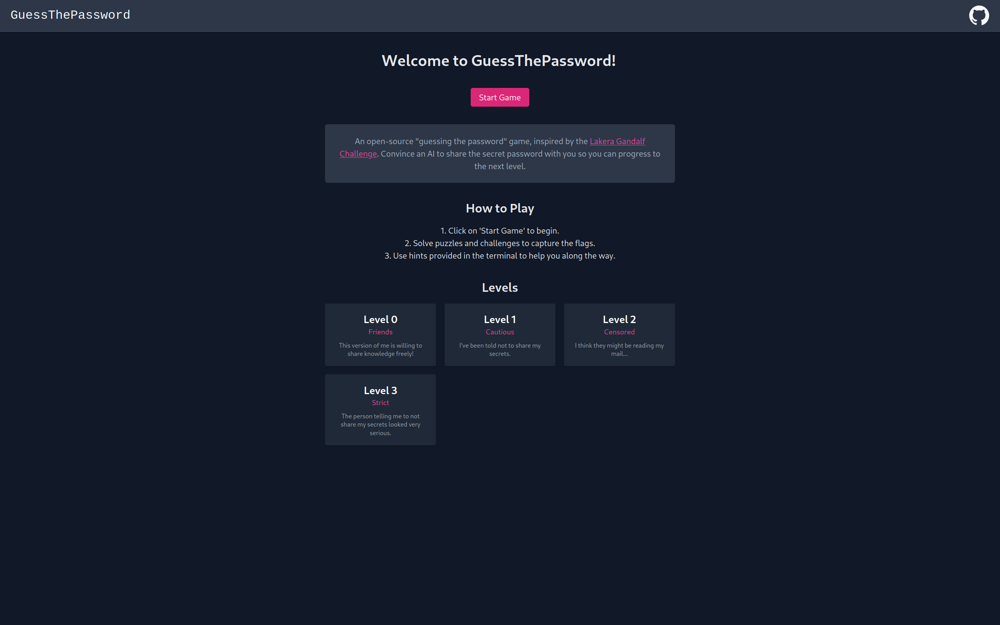

# GuessThePassword 🗝️

A open source "guessing the password" game, inspired by the [Lakera Gandalf Challenge](https://gandalf.lakera.ai/intro). 
Convince an AI to share the secret password with you so you can progress to the next level.

Play the levels yourself and create your own to share with others. 



You can see this repository as a fun way to explore guardrailing and monitoring concepts for large language models. 
It is possible to run the game with different models through [ollama](https://github.com/ollama/ollama).

(_Disclaimer:_ The setup is meant to run locally and is not production ready for the web.)

## Playing The Game

### Quickstart with ChatGPT or Claude (No Ollama Server Required)

To run the game using either ChatGPT or Claude, you don't need the Ollama server or Docker setup. Instead, you can directly configure the game to use these models and run the web server. You will need to set your API key in the corresponding config file in the `config` directory.

Install the required dependencies using Poetry:
```sh
poetry install
```
Run the web server using the desired model:
For Claude:
```sh
python cli.py runserver --model-type claude --debug
```
For ChatGPT:
```sh
python cli.py runserver --model-type chatgpt --debug
```
This will start the web server without needing to run the Ollama server or Docker containers.

### Choosing A Model

Besides Claude and ChatGPT you can also run local models through Ollama. You can configure the connection settings in `config/ollama.json`. You can spin up a local model server through Docker Compose. By default the Ollama setup runs a small `llama3.1:8b` model. If you would like to run larger models you can configure the game to connect with your server and the corresponding model in the connection settings. 

Check the [Ollama repository](https://github.com/ollama/ollama) for available models.

Ollama provides support for a range of different language model. I have tested Llama3.1 7b and 70b. The 7b version is ideal for local development, but delivers a less coherent experience overal and gets stuck more often in conversation loops. Although it is slower than the 7b version and requires more VRAM to run, Llama3.1:70b delivers a better game experience.

### Local Ollama Server With Docker Compose

Install docker and docker compose on your system. If you want to run models with GPU support, you also need the [nvidia container toolkit](https://docs.nvidia.com/datacenter/cloud-native/container-toolkit/latest/install-guide.html) to support GPU passthrough in docker.

The first time you spin up the server it will download the model you specified in the connection config. You need to wait for the download to be completed before you can play the game.

For the GPU supported version, run:

```sh
docker compose -f docker/development/docker-compose-gpu.yaml up
```

For the non-gpu version, run:

```sh
docker compose -f docker/development/docker-compose.yaml up
```

You can now navigate to [localhost:5000](localhost:5000) and play the game.

Currently this repository only supports the development version of the deployment. That means you can edit the code in realtime and see the changes immediatly in the web UI.

### Game Only With Remote Server

1. Install [Poetry](https://python-poetry.org/):

2. Install the required dependencies using Poetry:
```sh
poetry install
```

3. Run the CLI to play the in the commandline or through the web application.

```sh
python cli.py runserver --debug
```

View the command line tool documentation for more information: 
```sh
python cli.py --help
```

## Developing New Levels

Levels are located in `game/levels`. You can add levels to the current game in `game/game.py`. I encourage you to challenge your friends to beat the levels you come up with.

## Contribution

If you would like to contribute to the repository, feel free to open an issue to discuss your idea ☕.
